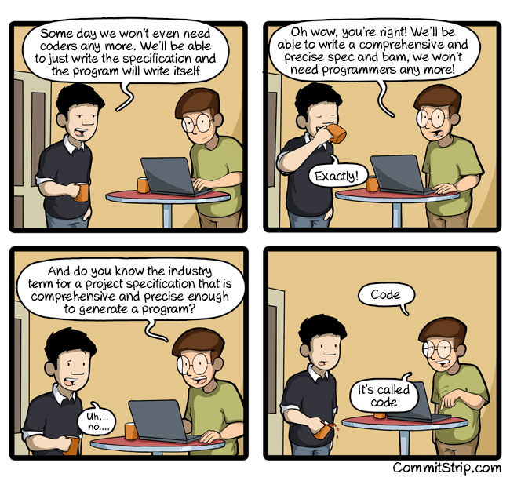

# 人工智能开发软件

Gerg Young, Nov 29, 2016

今年，我在维尔纽斯（Vilnius，立陶宛首都）主持了一个 BuildStuff.lt 上的小组活动。当我主持小组活动时我发现自己的角色是重述原始问题、跟进小组成员提出的观点（points）以及引导讨论的进行。在这次小组活动中我觉得有一个问题需要我来明确给一个回答（即使我作为主持人），因为关于这个问题，其他小组成员的回答都没有一个与我的想法相似。

这个问题的大意是：人工智能（Artificial Intelligence，AI）当前正以惊人的速度进步着，那么距离人工智能真正可以写代码还需要多久？

我的答案：

人工智能（artificial intelligence）正以惊人的速度向前发展，这是没问题的。10-15 年前，人们认为还需要 25 到 30 年时间计算机才能在围棋领域击败人类，至于独立驾驶汽车就不在话下了。。我们所取得的进步是惊人的。

也就是说软件开发（software development）是件截然不同的任务。

然我们来想像一下，如何利用人工智能来创造我们的软件。首先我们需要以某种方式来描述我们的业务问题，以及软件应该如何去做，这些都需要我们来明确。

为了做到这点，我们需要某种文本语言（textual language）。这种语言可能需要支持一些基本概念（basic concepts），包括基本布尔逻辑（basic boolean logic）、算法（arithmetic）和某些形式的控制流（control flow）。随后我们便可以使用这种语言来描述软件了……

大多数系统的难点在于搞清楚要构建什么。人工智能在这一方面还有很长一段路要走。

更新：添加一张图

原文地址：[https://goodenoughsoftware.net/2016/11/29/ai-develops-software/](https://goodenoughsoftware.net/2016/11/29/ai-develops-software/)