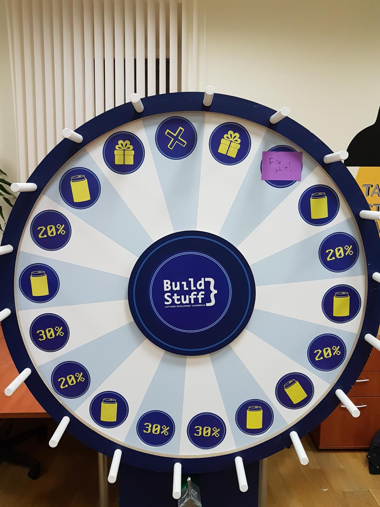

技术债务之轮

我们办公室里已经放了很多从 [http://buildstuff.lt](http://buildstuff.lt) 搞来的东西。我临时替我的同僚们管着这些，而其中有一样东西可能被证明是非常有用的。

技术债务（technical debt）是所有团队都须面对的问题。我们总是说我们会如何如何处理这个问题，然并暖……因为还有其它一些令人蛋疼的工作需要我们来处理，比如写一份讨厌的文档或一个简单的使用样例。我们倾向于使用一种新的东西来处理这些工作，而且随着时间的推移我们越发倾向于这么做。

就此，我有个想法。

现在，我们办公室里放了个这玩意儿：

这个想法就是不把技术债务（technical debt）、文档（documentation）等卡片放进积压工作中，而是把它们放在一个转轮（spinner）上。当然如果你明确地按照任务的优先级进行了排序，你也可以直接把它们放在积压工作中。

当你完成一项任务后，转动转轮。如果转轮的指针落在某张卡片上，就把这张卡片上的任务解决；如果没有落在卡片上，则继续积压。

我相信这么做有几个好处。首先是当你在处理这类任务时可最终得以获得一个固定的缓冲余地；其次是转轮转到每一个排定的任务的几率是均衡的（排定的任务越多，落到某一个任务就越是公平、均衡）。

还有一点，那就是这么做其实挺因吹斯听的！

应该有人会希望去尝试一下。如果你尝试这么做，请记得给我反馈哦~

原文地址：[https://goodenoughsoftware.net/2016/11/30/wheel-of-technical-debt/](https://goodenoughsoftware.net/2016/11/30/wheel-of-technical-debt/)

